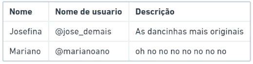
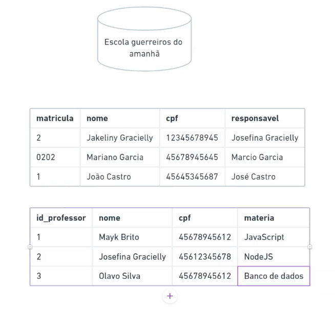
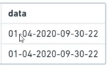
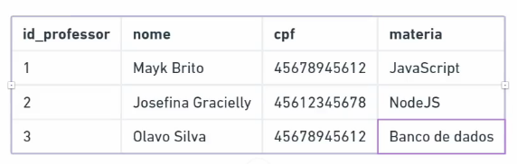

# O que é um banco de dados?

É um local onde será **guardado** informações de forma organizada, de forma sistêmica.


## Exemplo:

Um exemplo, é o seu celular, nele você tem a agenda de contatos, sua agenda é separada com cada pessoa que você cadastra, ou seja, cada pessoa tem um número de telefone, e um nome. Todos esses dados estão guardados em um banco de dados do seu celular e organizados de uma forma que o celular consiga mostrar para você.

> Então entendemos que o banco de dados é uma maneira de guardar informações de forma organizada.

O banco de dados surgiu para ficar no lugar dos **dados físicos**, como os armários de armazenamento em arquivos de papel, sendo assim, o banco de dados se torna um jeito mais fácil e rápido de encontrar os dados.

## Serviços de banco de dados

Nós temos alguns serviços de banco de dados, empresas que **oferecem o serviço de banco de dados**. Para seus clientes guardarem seus dados naquele serviço, e o próprio serviço fazer a gestão dos bancos de dados.

Alguns serviços:

- SQLite
- MariaDB
- MySQL
- PostgreSQL
- Oracle
- Firebase
- MongoDB
- Redis

Mas todos têm o mesmo objetivo de guardar dados de forma organizada e sistêmica num repositório.

## Tabelas

As informações são organizadas no banco de dados em **tabelas**. Veja a representação gráfica:



Em um banco de dados, vamos ver as informações desse mesmo jeito, dividido em tabelas, com as colunas, linhas e um cabeçalho.

### Campos

Os campos são os nomes das informações, ou seja, cada coluna tem um nome. Como visto na imagem anterior, temos os campos: _nome_, _nome de usuário_ e _descrição_. Contudo, os campos são os títulos das **informações** que vamos guardar nas tabelas.

### Informações

As informações são os dados que cadastramos em cada campo, e é o que realmente precisamos. Cada linha da tabela representa um registro que contém informações específicas, armazenadas em cada campo correspondente. Como na imagem anterior.

### Exemplo gráfico:



## Tipos de campos

Como vimos antes, temos os campos, que guardam as informações, entretanto, essas informações têm um contexto tipográfico para cada coluna, para cada campo. Como, por exemplo, um campo chamado "nome", logo, esse campo terá apenas letras, então será do tipo texto ou em inglês, "text", e se for um campo de registros de CPFs, terá somente números, sendo assim, será do tipo número, em inglês "number".

### TEXT

O tipo _text_, é um campo onde agrupará dados de textos, letras, símbolos ou letras com números e símbolos, como um nome ou uma descrição.

> Sempre usamos o campo de texto envolvido com aspas.

### NUMBER

O tipo number, é um campo de apenas números, como um CPF, Telefone, RA, etc.

### DATATIME

Datatime, significa "data e hora" em inglês, ele é usado, obviamente, para datas e horas:



Veja que, nessa imagem, as informações de dia, mês, ano, hora, minuto e segundo, estão separados por traços "-", e esse é um caso muito específico, que podemos tipar como Datatime.

### PRIMARY KEY

Primary Key, é um tipo de campo que usamos como identificador númerico:



Nessa imagem, o _id_professor_ é uma **Number Primary Key**. Pois contém números, e é um identificador númerico. Em um banco de dados, a Primary Key, vai controlar as informações da tabela segundo os números da Primary Key, entendendo que cada informação com um número diferente é uma informação única.

### Nomes de tabelas

Os nomes de tabelas devem sempre começar com letras, e não podem conter espaços. Além de, não poder usar alguns caracteres, como:

- `( ) + - / * " ; = & | # > < ^ ' { } %`

> Esses caracteres não podem ser usados nem em nomes de tabelas e nomes de campos, o que podemos usar mesmo é o underscore.

E também não é permitido acentuação, exemplo: "descricao", "voce".

## Comando SELECT

> Vamos usar os comandos do SQL daqui para frente.

O comando _SELECT_ tem como função buscar informações e mostrá-las:

```sql
SELECT * FROM tabela_alunos
-- Seleciona todos os dados da tabela "tabela_alunos"
```

- `SELECT` - Seleciona informações
- `\*` - Remete a tudo, todas as informações
- `FROM` - De onde, de qual tabela
- `tabela_alunos` - É o nome da tabela, indica a tabela

Ou seja, este comando, está selecionando tudo que há dentro de `tabela_alunos`.

> Os comandos SQL vão ser sempre em maiúsculo

### Especificando campos com SELECT

Podemos selecionar campos específicos com o `SELECT`, ou seja, podemos selecionar apenas os campos que desejarmos. Por exemplo:

```SQL
SELECT nome, cpf FROM registro
```

Esse comando seleciona apenas o campo _nome_ e _cpf_. Logo, a tabela será apresentada na ordem colocada no comando.

## SELECT com WHERE

Com o _WHERE_ podemos específicar ainda mais o que queremos selecionar:

```SQL
SELECT * FROM aluno WHERE id = 1
```

Nesse comando, primeiramente, estamos selecionando toda a tabela, e depois, com o _WHERE_ passamos uma condição para pegarmos o registro com o campo identificação igual a 1. Sendo assim, será mostrado o registro com a identificação de número 1.

```SQL
SELECT * FROM aluno WHERE nome like 'j%'
```

Esse outo comando, pega o campo nome e filtra todos os nomes que começam com a letra J. O comando _like_ significa _parecido_, ou seja, ele precisa ser parecido com isso daqui `'j%'`, isso daqui quer dizer que, começa com J e o resto tanto faz `%` (**J**osé Silva).

Pensando assim, podemos filtrar nomes que contenham alguma letra específica, por exemplo: `'%d%'` (Isaque **D**onato)

## Operadores Relacionais para usar com WHERE

### Igual, =

Já vimos esse operador quando buscamos o registro com o número de identificação igual a 1. Usamos esse operador para buscar um registro específico, em que a informação do campo seja igual a algum dado qualquer.

```SQL
SELECT * FROM tabela WHERE id = 1
-- Busca o registro em que o número da identificação seja igual a 1.
SELECT * FROM tabela WHERE nome = 'Marcos Aurélio'
-- Busca o registro em que o nome seja igual a 'Marcos Aurélio'
SELECT * FROM tabela WHERE cpf = 34243792342
-- Busca o registro em que o cpf seja igual 34243792342
```

### Like

O operador `like` pode ter a mesma função do operador igual e mais algumas funcionalidades, com ele podemos buscar conteúdos de texto sem saber o conteúdo completo, ou seja, podemos buscar um registro que tenha uma semelhança com o dado passado, fazemos essa semelhança usando o sinal de porcentagem `%`.

```SQL
SELECT * FROM tabela WHERE nome like 'M%'
```

O caractere % indica que qualquer caractere pode seguir depois do "M". Portanto, isso incluirá registros com valores como "Marcos", "Matheus", etc. Ou também podemos pegar registros em que tenha um campo que contenham alguma letra específica, por exemplo: `'%s%'` (Renata Lari**ss**a)

### Maior que, >

O operador maior que, funciona apenas com números, um exemplo, é que podemos pegar registros em que o número da identificação seja maior que 5.

```SQL
SELECT * FROM tabela WHERE id > 5
```

Esse comando irá mostrar registros em que o número de identificação seja maior que 5.

### Menor que, <

O operador menor que, funciona parecido com o operador de maior que, logo, ao invés de pegar registros em que o número de identificação seja menor que 4, por exemplo.

### Maior ou igual, >=

O operador maior ou igual, pega registro maior que um certo número, logo, ele inclui o registro com o "certo número", então, por exemplo:

```SQL
SELECT * FROM tabela WHERE id >= 4
```

Então, nesse comando estamos pegando registros com o número de identificação maior ou igual a 4.

> Logo, assim como o operador _menor que_, temos um operador _menor ou igual_

### Não igual a, <>

Esse operador tem a funcionalidade de tirar registros que atendem a uma condição específica. Exemplo:

```SQL
SELECT * FROM tabela WHERE id <> 2
```

Ou seja, pegue todos os registros cujo número de identificação não seja igual a 2.

### Diferente de, !=

Seguem a mesma atividade do operador de _não igual, <>_. Mas com outra lógica. Esse operador, pega qualquer registro com o número diferente de tal número passado. Exemplo:

```SQL
SELECT * FROM tabela WHERE id != 5
-- Pega qualquer registro com o número de identificação diferente de 5
```

## Operadores Matemáticos

Podemos usar operadores matemáticos para nos ajudarmos a buscar um registro:

```SQL
SELECT * FROM tabela WHERE id = 1 + 1
```

Logo, buscará o registro com o número de identificação igual a 2. Contudo, podemos fazer esses tipos de operações com adição (+), subtração (-), multiplicação (\*), divisão (/) e o resto da divisão (%).

## Operadores Lógicos

### AND

O operador _AND_ tem como função buscar registros de forma bem específica, como, por exemplo:

```SQL
SELECT * FROM tabela_alunos WHERE nome like 'J%' AND id > 2
```

Nesse comando, estamos pedindo um registro cujo nome deve começar pela letra _J_ e o número de identificação deverá ser maior que 2. Contudo, podemos colocar ainda mais condições para que a busca seja mais específica ainda:

```SQL
SELECT * FROM tabela_alunos WHERE nome like 'K%' AND id > 2 AND nome_responsavel like '%C%'
```

### OR

```SQL
SELECT * FROM tabela_alunos WHERE id < 8 OR nome like 'A%'
```

Esse comando, pede registro cujo número de identificação seja menor que 8 ou um registro cujo nome comece com a letra A. Logo, qualquer registro em que o id seja menor que 8, e registro em que o nome comece com a letra A, será trazido.

### BETWEEN e NOT BETWEEN

Supondo que queremos uma lista de funcionários, funcionários que trabalharam até tarde, por exemplos. Contundo, tenho que buscar funcionários com o id de 4 até 7. Com o que aprendemos até agora podemos fazer isso:

```SQL
SELECT * FROM funcionarios
WHERE id_funcionario = 4 OR id_funcionario = 5 OR id_funcionario = 6 OR id_funcionario = 7
```

Entretanto, vimos que esse comando ficou meio grande, então é aí que entra o _BETWEEN_. "between" significa entre, o que faz sentido, pois estamos pegando números entre um intervalo de 4 e 7:

```SQL
SELECT * FROM funcionarios WHERE id_funcionario BETWEEN 4 and 7
```

Mas, caso queremos pegar uma lista de todos os funcionários, menos os funcionários que tenham o id no intervalo 4 e 7. Nesse caso, usamos o **NOT BETWEEN**, ele vai ignorar todos os funcionários que tenham o id no intervalo 4 e 7:

```SQL
SELECT * FROM funcionarios WHERE id_funcionario NOT BETWEEN 4 and 7
```

## IN e NOT IN

Agora, queremos buscar funcionários com o número de identificação distintos, sem ser uma sequência ordenada de números, mas sim de forma "aleatória". Nesse caso, usamos o _IN_, seguido de parenteses, e dentro de parenteses colocamos a ordem dos números que desejamos, separados por vírgulas:

```SQL
SELECT * FROM funcionarios WHERE id_funcionario IN (3, 5, 7, 9)
```

E assim como o _NOT BETWEEN_, existe o _NOT IN_, que ignora esses números e traz os restos dos registros.

## IS NULL e IS NOT NULL

Esse operador (IS NULL) traz registros ou campos específicos em que alguma informação dos registros tenha a propriedade "null" (vazio).

```SQL
SELECT * FROM funcionarios WHERE id_departamento IS NULL
```

Esse comando trará todos os registros de funcionários cujo id de departamento é vazio (null). Logo, temos também o _IS NOT NULL_, que faz o contrário do comando anterior, e traz os registros cujo id de departamento não é _NULL_.

```SQL
SELECT * FROM funcionarios WHERE id_departamento IS NOT NULL
```

## Criando registros

Podemos criar registros usando o comando _INSERT INTO_ (INSIRA DENTRO DE), depois escolhemos em qual tabela queremos inserir um registro, em seguida, abrimos parenteses, e dentro dos parenteses escolhemos as informações que queremos preencher (O campo de identificação é do tipo PRIMARY KEY, logo, não é necessário preenchê-lo, pois o próprio SQL o pre enche). Após escolher os campos, vamos digitar os valores desses campos, utilizando o comando _VALUES_, seguido de parenteses, e dentro dos parenteses, vamos inserir os valores:

```SQL
INSERT INTO tabela(nome, telefone, departamento) VALUES ('Olivia Almeida', 994484388, 05)
```

E após executar esse comando, e vermos a tabela, estará lá o nosso novo registro.

## Atualizando registros

Podemos atualizar as informações de um registro específico, usando o comando _UPDATE_. Após digitarmos o comando _UPDATE_, colocamos o nome da tabela na qual vamos editar, depois, colocamos o comando _SET_, para setarmos as novas informações: `nome = 'Tânia José', telefone = 987654321`, logo após, temos que informar qual registro queremos setar as novas informações, para isso usamos o _WHERE_ especificando o id da pessoa, por exemplo:

```SQL
UPDATE pessoas SET nome = 'Mariano Santos', telefone = 923537834 WHERE identificador = 2
```

Nesse comando, estamos atualizando a tabela _pessoas_, setando o nome como 'Mariando Santos', e o telefone como 923537834, e todas essas mudanças vão para o registro cujo identificador é igual a 2.

## Deletando registros

Usamos o comando _DELETE_ para apagar registros. Contudo, o comando não apaga a informação de um campo, ele só apaga registros.

```SQL
DELETE FROM tabela WHERE identificador = 3
```

Esse comando apaga um registro na tabela cujo identificador é igual a 3.

> O DELETE deve sempre estar acompanhado do WHERE, pois, se rodar o comando `DELETE FROM tabela`, irá apagar todos os registros da tabela.